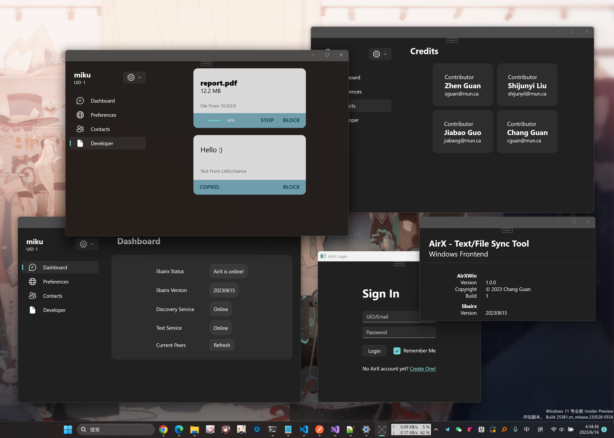
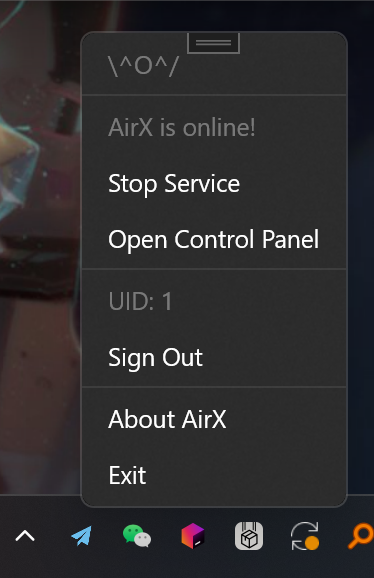
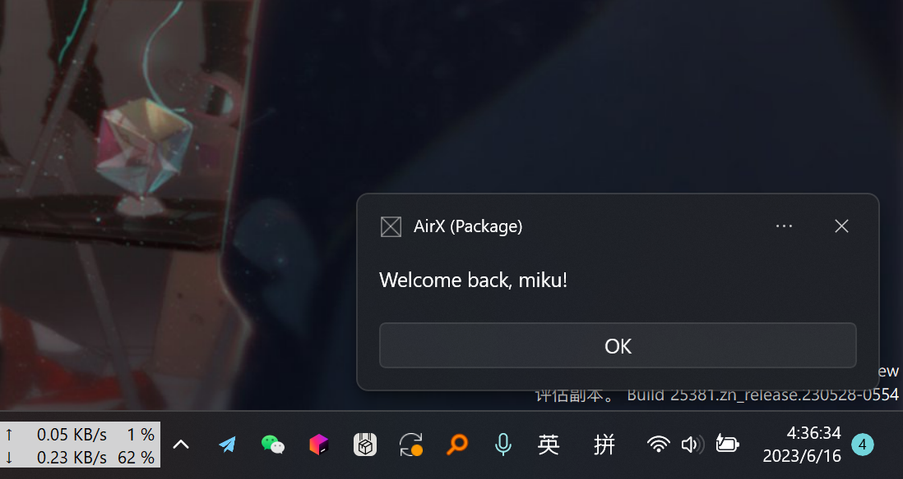

# AirX Windows Frontend

## Update 0616

---

## 新增内容

- 主界面菜单化，常态没有窗口浮在屏幕上，而是变成托盘图标，点了弹出菜单。
    - 微软有想法未来废除托盘图标，不过引起了民愤，所以托盘图标应该还能坚挺。况且这个设计真的很好用。
    - 在菜单中，可以：
        - 查看/开/关AirX服务
        - 打开控制面板（原SplitView）
        - 查看/登录/注销当前账号
        - 打开关于页面
        - 退出软件

- 从局域网收到文本后，能正确弹出提示了，**不过目前走的是推送通知的小窗口**，如下图，虽然挺好看的，不过仍然不是我们想要的`NoticeWindow`。后者目前刚刚还原了设计稿，还没加入ViewModel，所以先拿推送通知顶上。

- 实现了较为成熟的登录流程，自动登录AirX账号，登录一次后记住token，后续启动优先尝试续期token，若成功则直接自动登录。每次启动都会自动弹出Sign In窗口，除非自动登录成功则不弹。本地只保存token不保存密码。

- 工程重构了一遍，模块之间基本解耦，一些逻辑进行了升级，比如：
    - 接入了可本地保存的设置
    - 全局用上了Win11同款的**Mica模糊半透效果**，设计前卫，可以强调一下目前微软自己的软件还没完全转型到Mica系列呢

## 遇到了什么困难

- 由于新版`libairx`的一个不易察觉的bug，导致调用AirX服务的时候程序会无征兆的出错，异常也捕获不到有用信息，险些冤枉了WinUI3（Windows App SDK框架本身），最后还是在`libairx`里面找到了问题，已经修复。
- 推送通知：Windows App SDK所推荐的最新推送通知的发送方式，存在诸多限制，比如应用想能顺利发通知，必须要和微软注册，有点麻烦，在这里花了不少时间。旧版API没有这些限制，但是身为WinUI3好像不太好用旧版API。
- 状态共享：最近的新UI框架很多，虽然确实好看，但是实现简单操作的成本也在上升，学习成本实在很高。经过了仔细的阅读微软文档，实现了本该实现的状态共享功能，所谓状态共享就是比如
    - 登录成功了，菜单里面如何感知到，然后显示“注销”而不是“登录”
    - 从局域网收到文本，如何通知到主界面，然后弹出通知
    - 等等。
- XAML的不好的体验：用XAML设计界面的体验不能算好，主要两方面：
    - *缺少实时预览。*隔壁SwiftUI至少有个实时预览功能，但是WinUI3是真全靠脑补（甚至WinUI2都有预览...）。
    - *语法怪异。*和其他各个领域的各个框架的语法毫无交集，落后的绑定机制需要大量冗余逻辑。
    - *系列工具链不好使。*主要VS太卡了！
- 代码编写方面应该可以有一些困难，我全在吐槽WinUI3了，其实C#本身也是有坑的，尝试从个人经验出发再说一点。

## 下一步做什么

- 把前面提到的`NoticeWindow`实装。
- 配合后端实现基于互联网的文本同步，这一点本该这周完成的，不过没想到这些前端工作会这么多，所以就先搁置了。
- 设置机制虽然完善了，前端的设置页还很是简陋，需要完善。
- 接入Google Sign In，这一点隔壁macOS已经接入了，路线摸通。
- 局域网的文件传送，要等`libairx`进行支持。

